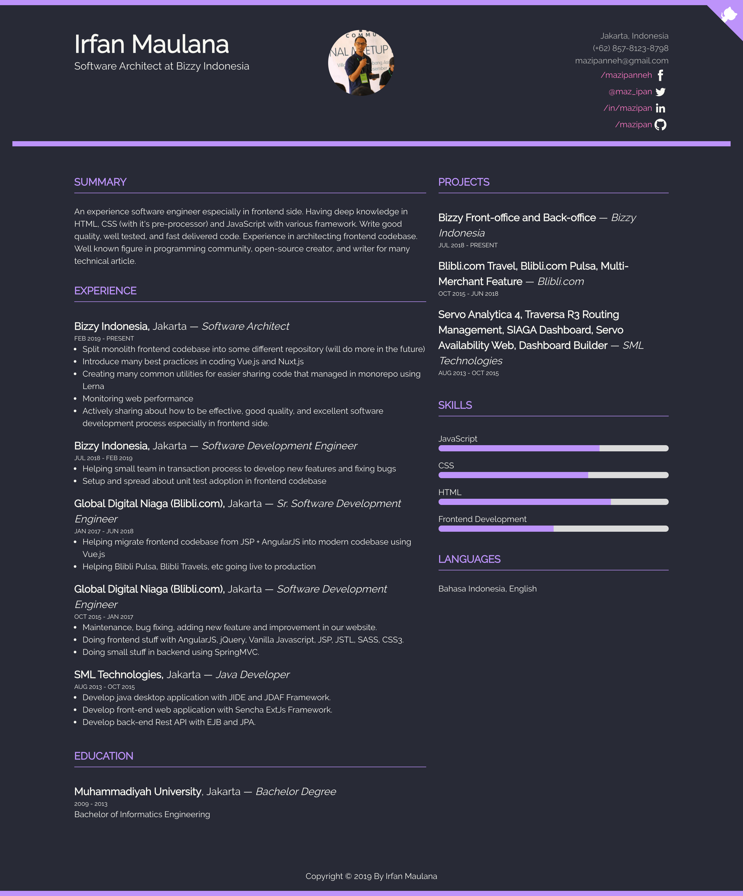
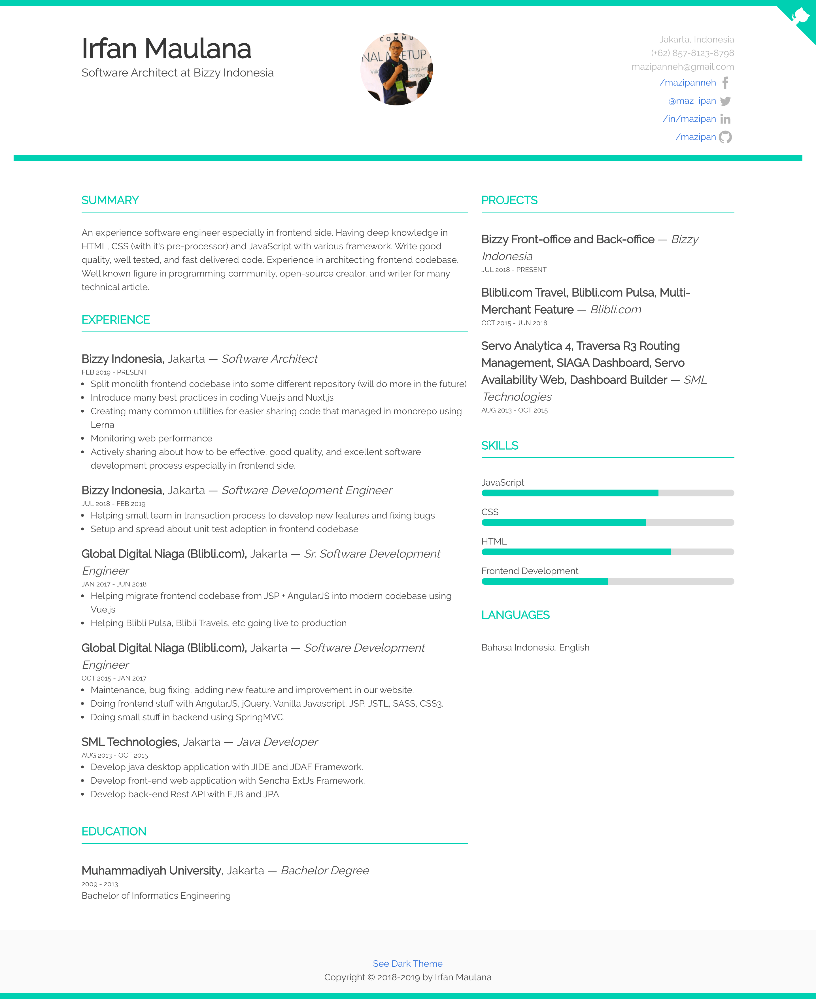
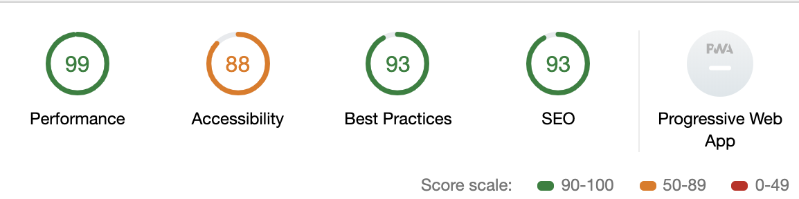

# bulma-resume-template

💼 Free resume page template with bulma css

[](https://travis-ci.org/mazipan/bulma-resume-template) 

## Live Demo

- Dark Theme: [/bulma-resume-template/](https://mazipan.github.io/bulma-resume-template/)
- Light Theme: [/bulma-resume-template/light/](https://mazipan.github.io/bulma-resume-template/light/)

## Feature

- Hot Module Replacement (HMR) in local development
- Optimized assets (HTML minified, CSS purge and minified, JS minified)
- Easy to update content
- Available in light and dark theme version
- Mobile friendly interface
- Lightning speed load time performance

## Screenshoot

|            Dracula Theme            |           Light Theme           |
| :---------------------------------: | :-----------------------------: |
|  |  |

## Lighthouse Audit



## Update with your own!

Just go update file [\_data/content.js](https://github.com/mazipan/bulma-resume-template/blob/master/src/_data/content.js) with your own data.

Below is sample of structure data that you can found in the file:

```javascript
module.exports = {
  profile: {
    name: 'Irfan Maulana',
    title: 'Principal Engineer for Frontend at Tokopedia',
    photo: 'https://avatars2.githubusercontent.com/u/7221389?s=300&v=4', // 300x300px
    city: 'Jakarta, Indonesia',
    phone: '(+62) 876-123-0000',
    mail: 'mazipanneh@gmail.com',
  },
  social: {
    facebook: {
      name: 'mazipanneh',
      link: 'https://web.facebook.com/mazipanneh',
    },
    twitter: {
      name: '@maz_ipan',
      link: 'https://twitter.com/Maz_Ipan',
    },
    linkedin: {
      name: 'in/mazipan',
      link: 'https://www.linkedin.com/in/mazipan',
    },
    github: {
      name: 'mazipan',
      link: 'https://github.com/mazipan',
    },
  },
  summary: 'summary',
  experiences: [
    {
      company: 'Tokopedia',
      location: 'Jakarta',
      title: 'Principal Engineer for Frontend',
      period: 'JUN 2019 - PRESENT',
      jobdesc: [],
    },
  ],
  educations: [
    {
      name: 'Muhammadiyah University',
      city: 'Jakarta',
      degree: 'Bachelor Degree',
      period: '2009 - 2013',
      faculty: 'Bachelor of Informatics Engineering',
    },
  ],
  projects: [
    {
      title: 'AAAAA',
      company: 'AAAAA',
      period: 'JUL 2018 - JUN 2019',
    },
  ],
  skills: [
    {
      name: 'AAAAA',
      progress: 70,
    },
  ],
  languages: [],
};
```

## Development

```
# Install pnpm
$ npm i -g pnpm

# Install dependencies
$ pnpm install

# Run in your locals
$ pnpm run dev
```

## Support me

- 👉 🇮🇩 [Trakteer](https://trakteer.id/mazipan?utm_source=github)
- 👉 🌍 [BuyMeACoffe](https://www.buymeacoffee.com/mazipan?utm_source=github)
- 👉 🌍 [Paypal](https://www.paypal.me/mazipan?utm_source=github)
- 👉 🌍 [Ko-Fi](https://ko-fi.com/mazipan)

---

Copyright © 2018-2019 by Irfan Maulana
